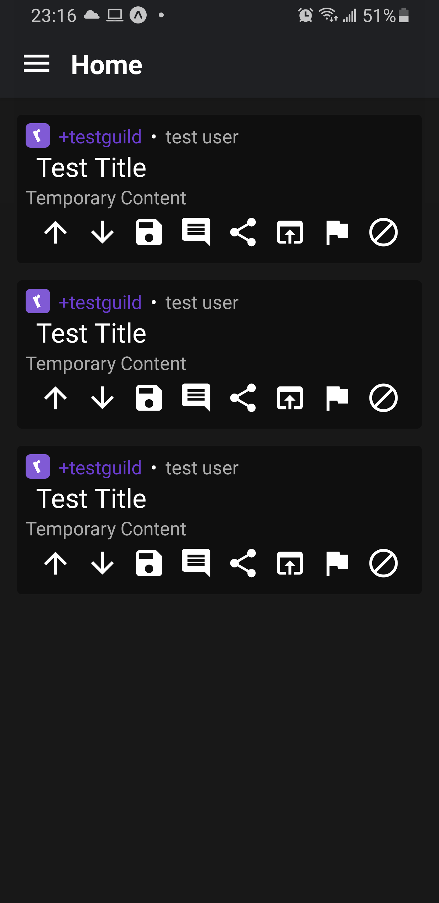

# Scroll For Ruqqus

This is a 3rd party [Ruqqus](https://ruqqus.com/) client for Android and iOS\* written in React Native following [Boost For Reddit's](https://play.google.com/store/apps/details?id=com.rubenmayayo.reddit) UI/UX.

## Auth server security conserns

This server is programmed to not record user access keys. The one consern I do have is that client secrets have to be stored in plain text. If you want to solve these conserns, please implement oauth on [ruqqus](https://github.com/ruqqus/ruqqus)

## Todo

- [ ] Icon and logo design
- [x] Still waiting on app keys from ruqqus admins
- [ ] Implement app ¯\\\_(ツ)_/¯
- [ ] Ruqqus api requires implicit oauth

* I don't have an iPhone so iOS compatibility is gonna be shotty. If you have an iPhone and are willing to fix, plz submit pull request