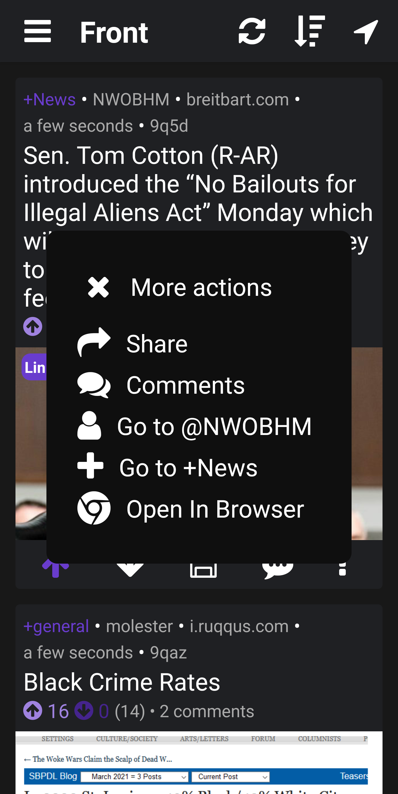

# Scroll For Ruqqus

This is a 3rd party [Ruqqus](https://ruqqus.com/) client for Android and iOS\* written in React Native following [Boost For Reddit's](https://play.google.com/store/apps/details?id=com.rubenmayayo.reddit) UI/UX.

## Features

- Not bound to any one domain
- Posting
- Commenting
- Guild mastering

## Dev setup

1. Have [nodejs](https://nodejs.org/en/download/package-manager/) installed
2. Clone this repo and open a terminal in it
3. Run `npm i` to install all the dependencies
4. While that's working download the [expo](https://expo.io/tools#client) app on your phone
5. When you have all the dependencies run `npm run web` to start the hotreloader
6. Scan the QR code that will appear in your terminal or browser with the expo app

## Todo

- [ ] Icon and logo design
- [x] Still waiting on app keys from ruqqus admins
- [ ] Implement app ¯\\\_(ツ)\_/¯
- [ ] Ruqqus api requires implicit oauth

\* I don't have an iPhone so iOS compatibility is gonna be shotty. If you have an iPhone and are willing to fix, plz submit pull request
